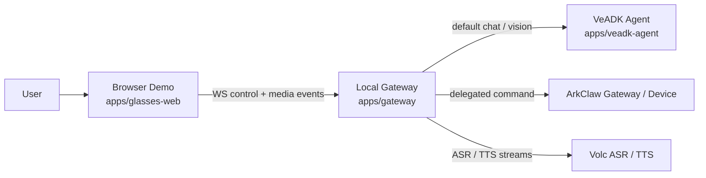

# AI Glasses Demo Architecture

## Goal

Build a local demo that simulates AI glasses in the browser, streams user audio to a local gateway, routes requests to either a VeADK agent or ArkClaw, and returns short spoken answers plus full visual results.

## Topology



## Components

### `apps/glasses-web`

- Start / stop conversation controls.
- Live transcript and assistant status UI.
- Camera preview and still photo capture.
- Audio playback for short TTS responses.
- Full answer and task result panels.

### `apps/gateway`

- Owns session lifecycle and state machine.
- Receives browser control events and media payloads.
- Integrates with Volc ASR/TTS streams.
- Routes default traffic to VeADK.
- Forwards configured intents to ArkClaw and reports async status back.

### `apps/veadk-agent`

- Python service built on FastAPI.
- Handles default Q&A, web search, and image understanding.
- Returns concise speech text plus full display text via SSE streaming.
- Provides `/speech` endpoint for LLM-based speech text generation (ack/result/chat contexts).
- Persistent user profile per userId.
- All prompts hardcoded in `DEFAULT_PROMPT_*` constants (no `.env` overrides).

### `packages/shared`

- Shared event names and payload contracts.
- Session state constants.
- Intent names and helper utilities.

## State Machine

```text
idle → listening → thinking → speaking → listening
                   ↘ delegating_to_arkclaw → speaking → listening
                   ↘ capture_photo_request → (photo received) → thinking → speaking → listening
```

## Interaction Rules

1. User must click `Start Conversation` to open the mic and camera.
2. Gateway treats ASR VAD segments as utterance boundaries.
3. Gateway sends only short summary text to TTS (per sentence, streaming).
4. Full answers and task execution details are rendered in the browser.
5. `send_feishu_message` and `edit_video` are routed to ArkClaw.
6. Photo understanding is single-shot only. No realtime video reasoning in v1.
7. User profile is persisted per userId across sessions.
8. WebSocket disconnection terminates the current session on both sides; the client stops audio capture and resets UI, requiring manual restart.

## Delivery Phases

1. Skeleton, protocol, and local session plumbing.
2. Streaming audio in/out with manual start/stop.
3. VeADK default chat and image understanding.
4. ArkClaw delegation for Feishu message commands.
5. UX hardening, timeout handling, and demo polish.
